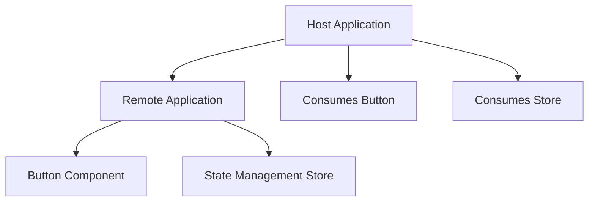

# Micro-Frontend with Vite Module Federation

This repository demonstrates a micro-frontend architecture using Vite's Module Federation plugin. It showcases how to share components and state between two separate Vite applications.

## Table of Contents
- [Architecture](#architecture)
- [What This App Does](#what-this-app-does)
- [Prerequisites](#prerequisites)
- [Getting Started](#getting-started)
- [Project Structure](#project-structure)
- [How It Works](#how-it-works)
- [Documentation](#documentation)

## Architecture



## What This App Does

This micro-frontend application demonstrates how to share components and state between two separate Vite applications using Module Federation:

1. The **Remote Application** exposes:
   - A simple Button component
   - A Zustand store for state management with persistence

2. The **Host Application** consumes:
   - The Button component from the remote
   - The state management store from the remote
   - Uses the remote's increment function to modify the shared state

The key feature is that both applications share the same state, so when you click a button in either application, the counter value updates in both.

## Prerequisites

- Node.js (v14 or higher)
- npm or yarn

## Getting Started

1. Install dependencies for both applications:

```bash
# Install dependencies for both applications at once
npm install

# Or install individually
cd host && npm install && cd ..
cd remote && npm install && cd ..
```

2. Start both applications:

```bash
# Start both applications concurrently
npm run dev

# Or start individually (remote must be started first)
cd remote && npm run dev
# In another terminal
cd host && npm run dev
```

3. Open your browser:
   - Remote app: http://localhost:5001
   - Host app: http://localhost:3000

## Project Structure

```
.
├── host                 # Host application
│   ├── src
│   │   ├── App.jsx      # Host application component
│   │   └── main.jsx     # Host application entry point
│   ├── vite.config.js   # Host Vite configuration with Module Federation
│   └── package.json     # Host dependencies
├── remote               # Remote application
│   ├── src
│   │   ├── App.jsx      # Remote application component
│   │   ├── Button.jsx   # Component exposed to host
│   │   └── store.js     # State management exposed to host
│   ├── vite.config.js   # Remote Vite configuration with Module Federation
│   └── package.json     # Remote dependencies
├── docs                 # Documentation
│   ├── architecture.md  # Architecture documentation
│   ├── development.md   # Development guide
│   └── modules.md       # Module documentation
├── start-all.sh         # Bash script to start both applications
├── start-all.ps1        # PowerShell script to start both applications
└── package.json         # Root package.json with convenience scripts
```

## How It Works

### Module Federation Configuration

The magic happens through Vite's Module Federation plugin:

1. **Remote Configuration** (`remote/vite.config.js`):
   - Exposes the Button component and store
   - Configures shared dependencies (react, react-dom, zustand)

2. **Host Configuration** (`host/vite.config.js`):
   - Imports the remote module from `http://localhost:5001/assets/remoteEntry.js`
   - Maps it to `remoteApp` for easy importing

### Shared State Management

The remote application uses Zustand for state management with persistence:

- The store is exposed to the host application
- Both applications can read and modify the same state
- State changes in one application are immediately reflected in the other

### Component Sharing

The host application imports and uses the Button component from the remote:

```jsx
import Button from "remoteApp/Button";
```

It also imports and uses the state management functions:

```jsx
import useStore from 'remoteApp/store';
const { count, increment } = useStore()
```

## Documentation

For more detailed information, please refer to the documentation in the [docs](./docs) directory:

- [Architecture](./docs/architecture.md)
- [Development Guide](./docs/development.md)
- [Module Documentation](./docs/modules.md)