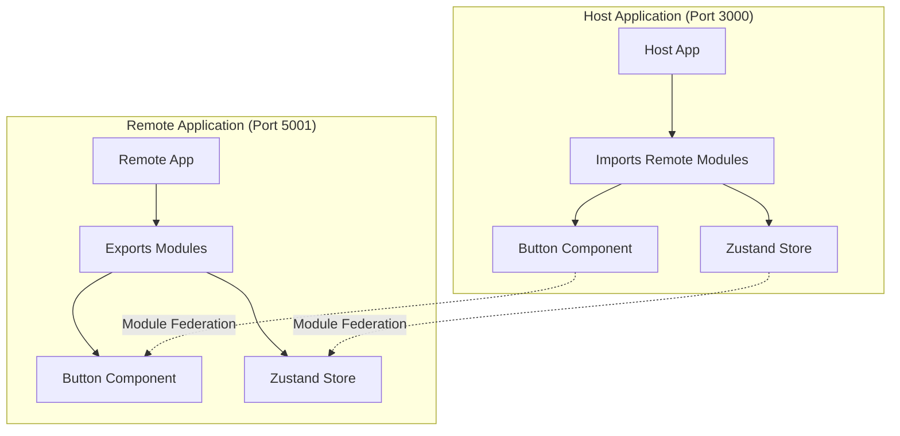

# Architecture Documentation

## Overview

This project demonstrates a micro-frontend architecture using Vite's Module Federation plugin. The architecture consists of two separate applications:

1. **Host Application**: Consumes modules from the remote application
2. **Remote Application**: Exposes modules for consumption by the host application

## Architecture Diagram

## Key Components

### 1. Host Application

Located in the [host](../host) directory, this application:
- Consumes the Button component from the remote application
- Uses the state management store from the remote application
- Runs on port 3000

### 2. Remote Application

Located in the [remote](../remote) directory, this application:
- Exposes a Button component
- Exposes a Zustand store with persistence
- Runs on port 5001

## Module Federation Flow

1. Remote application builds and serves modules via `remoteEntry.js`
2. Host application imports modules from `http://localhost:5001/assets/remoteEntry.js`
3. Shared dependencies (react, react-dom, zustand) are deduplicated
4. Runtime communication enables shared state and component usage

## Benefits of This Architecture

1. **Independent Development**: Teams can work on host and remote applications separately
2. **Technology Agnostic**: Different frameworks can be used for host and remote (though this example uses React for both)
3. **Shared State**: Applications can share state through exposed stores
4. **Component Reusability**: Components can be shared across applications
5. **Deployment Flexibility**: Applications can be deployed independently